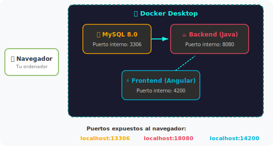
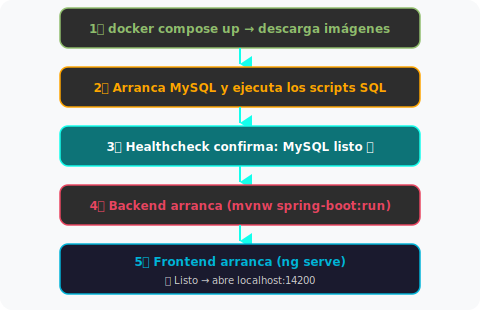
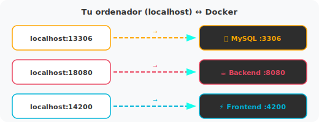
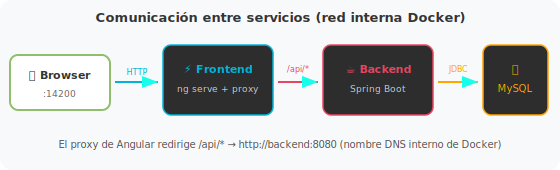

# Configuración del Entorno Local — ChefPro

Con un solo comando (`docker compose up`) levantas la aplicación completa en tu ordenador: base de datos MySQL, backend Java y frontend Angular. No necesitas instalar MySQL, Java ni Node — Docker se encarga de todo.



Un contenedor es básicamente una "caja" aislada que trae dentro un programa y todo lo que necesita para funcionar. Docker crea esas cajas por ti. Así no tienes que instalar nada a mano: cada contenedor viene con lo suyo.

## Resumen rápido

```bash
# 1. Instalar Docker Desktop (solo la primera vez)
# 2. Crear el archivo .env:
cp .env.example .env

# 3. Levantar todo:
docker compose up

# 4. Abrir en el navegador:
#    http://localhost:14200
```

Si necesitas más detalle (sobre todo en **Windows**), sigue leyendo.

---

## Índice

| # | Sección | Descripción |
|:-:|---------|-------------|
| 1 | [Instalar Docker Desktop](#1-instalar-docker-desktop) | Preparar tu ordenador (solo una vez) |
| 2 | [Clonar el repositorio](#2-clonar-el-repositorio) | Descargar el código |
| 3 | [Crear el archivo .env](#3-crear-el-archivo-env) | Configurar credenciales locales |
| 4 | [Levantar el entorno](#4-levantar-el-entorno) | Arrancar los 3 servicios |
| 5 | [Verificar que funciona](#5-verificar-que-funciona) | Comprobar que va bien |
| 6 | [Comandos del día a día](#6-comandos-del-día-a-día) | Lo que usarás constantemente |
| — | [Cómo funciona por dentro](#cómo-funciona-por-dentro) | Arquitectura interna |
| — | [Problemas frecuentes](#problemas-frecuentes) | Cuando algo falla |
| — | [Glosario](#glosario) | Términos técnicos |

---

## 1. Instalar Docker Desktop

Docker Desktop es lo que permite ejecutar contenedores en tu ordenador. Solo hay que instalarlo una vez.

### En Windows

1. Descarga desde [docker.com/products/docker-desktop](https://www.docker.com/products/docker-desktop/)
2. Ejecuta el instalador y sigue el asistente
3. Cuando pregunte, activa **"Use WSL 2 instead of Hyper-V"**
4. Reinicia si te lo pide
5. Abre Docker Desktop y espera a que diga **"Docker Desktop is running"**

Necesitas Windows 10/11 con WSL2. Si no lo tienes activado:
1. Abre **PowerShell como Administrador**
2. Ejecuta `wsl --install`
3. Reinicia
4. Luego instala Docker Desktop

<details>
<summary>¿Cómo sé si Docker está funcionando?</summary>

Abre una terminal y ejecuta:

```bash
docker --version
docker compose version
```

Si ves las versiones, todo bien. Si dice "no se reconoce el comando", Docker Desktop no está abierto o no se instaló bien.
</details>

### En macOS

1. Descarga desde [docker.com/products/docker-desktop](https://www.docker.com/products/docker-desktop/) (elige tu chip: Intel o Apple Silicon)
2. Abre el `.dmg` y arrastra Docker a Aplicaciones
3. Ábrelo y espera a que el icono de la ballena se estabilice en la barra superior

---

## 2. Clonar el repositorio

Si aún no tienes el código:

**Windows (PowerShell o Git Bash):**
```bash
cd C:\Users\TU_USUARIO\Documents
git clone https://github.com/varelaiglesiascarmen/ChefPro.git
cd ChefPro
```

**macOS/Linux (Terminal):**
```bash
cd ~/Documents
git clone https://github.com/varelaiglesiascarmen/ChefPro.git
cd ChefPro
```

Si no tienes Git en Windows, descárgalo de [git-scm.com](https://git-scm.com/download/win) y acepta las opciones por defecto.

---

## 3. Crear el archivo .env

El `.env` tiene las contraseñas y configuración de la base de datos. No se sube a Git (está en `.gitignore`), así que hay que crearlo a mano.

**Windows (PowerShell):**
```powershell
copy .env.example .env
```

**macOS/Linux:**
```bash
cp .env.example .env
```

El `.env.example` ya viene con valores que funcionan para desarrollo local. No hace falta cambiar nada:

```dotenv
# --- MySQL ---
MYSQL_ROOT_PASSWORD=chefpr01;
MYSQL_DATABASE=chef_pro

# --- Spring Boot (Backend) ---
SPRING_DATASOURCE_URL=jdbc:mysql://db:3306/chef_pro
SPRING_DATASOURCE_USERNAME=root
SPRING_DATASOURCE_PASSWORD=chefpr01;
```

¿Por qué pone `db` en vez de `localhost`? Porque dentro de Docker los contenedores se llaman entre sí por el nombre del servicio. El servicio de MySQL se llama `db` en `docker-compose.yml`, así que el backend usa `db:3306`.

**Importante:** el `.env` tiene contraseñas. Nunca lo subas a Git. Ya está en `.gitignore`, así que Git lo ignora automáticamente.

---

## 4. Levantar el entorno

Primero asegúrate de que Docker Desktop está abierto (en Windows: busca "Docker Desktop" en el menú Inicio y espera a que diga que está corriendo).

Luego, abre una terminal **en la carpeta raíz de ChefPro** y ejecuta:

```bash
docker compose up
```

La primera vez tarda bastante porque tiene que descargar las imágenes y compilar todo. Las siguientes veces va mucho más rápido.



La terminal se queda mostrando los logs en tiempo real — es normal. Déjala abierta mientras trabajas y usa otra terminal para otros comandos.

En Windows, si sale un aviso del Firewall pidiendo permiso, dale a **"Permitir acceso"**.

---

## 5. Verificar que funciona

| Qué verificar | URL | Qué deberías ver |
|----------------|-----|-------------------|
| Frontend Angular | [http://localhost:14200](http://localhost:14200) | La página principal de ChefPro |
| Backend API | [http://localhost:18080/api/auth/health](http://localhost:18080/api/auth/health) | Una respuesta del servidor |
| Swagger (docs API) | [http://localhost:18080/swagger-ui/index.html](http://localhost:18080/swagger-ui/index.html) | La interfaz de documentación |

Si no va, espera un poco — el backend tarda 1-2 minutos en compilar la primera vez. Revisa los logs en la terminal y mira [Problemas frecuentes](#problemas-frecuentes).

---

## 6. Comandos del día a día

Siempre desde la carpeta raíz de ChefPro.

### Arrancar y parar

| Quiero... | Comando |
|-----------|---------|
| Levantar todo | `docker compose up` |
| Levantar en segundo plano | `docker compose up -d` |
| Parar todo | `Ctrl + C` (o `docker compose down` si usaste `-d`) |
| Levantar solo la BD | `docker compose up db` |

### Ver logs

| Quiero... | Comando |
|-----------|---------|
| Logs de todo | `docker compose logs` |
| Logs del backend en tiempo real | `docker compose logs -f backend` |
| Logs del frontend en tiempo real | `docker compose logs -f frontend` |
| Qué contenedores están corriendo | `docker compose ps` |

### Resetear

| Quiero... | Comando | Efecto |
|-----------|---------|--------|
| Parar todo | `docker compose down` | Los datos de MySQL se conservan |
| Parar y borrar la BD | `docker compose down -v` | Borra todos los datos. Los scripts SQL se vuelven a ejecutar |
| Reconstruir el backend | `docker compose up --build backend` | Recompila desde cero |
| Reconstruir el frontend | `docker compose up --build frontend` | Reinstala dependencias |

### Ejecutar cosas dentro de un contenedor

```bash
# Terminal dentro del backend
docker compose exec backend sh

# Conectarse a MySQL
docker compose exec db mysql -u root -p
# (contraseña: chefpr01;)

# Generar un componente Angular
docker compose exec frontend npx ng generate component mi-componente
```

---

## Cómo funciona por dentro

### Puertos



Los puertos son diferentes a los estándar (14200, 18080, 13306) para no chocar con otros programas que puedas tener. Si tienes un MySQL local en el 3306, el de Docker usa el 13306 y no hay conflicto.

### Comunicación entre servicios



### Volúmenes (datos persistentes)

Docker usa volúmenes para que los datos sobrevivan cuando paras los contenedores:

| Volumen | Qué guarda | Se borra con `down -v` |
|---------|-----------|:----------------------:|
| `chefpro-mysql-data` | Datos de la base de datos | Sí |
| `chefpro-maven-repo` | Dependencias de Maven (caché) | Sí |
| `chefpro-frontend-node-modules` | Dependencias de npm | Sí |

`docker compose down` (sin `-v`) conserva estos datos. `docker compose down -v` los borra — útil para empezar de cero.

### Código fuente

El código que editas en VS Code no se copia dentro de los contenedores, sino que se monta como un volumen. Esto significa que:

- Los cambios que hagas se reflejan automáticamente dentro del contenedor
- El frontend Angular recarga la página solo (hot reload)
- El backend puede necesitar un reinicio manual (a no ser que tengas `spring-boot-devtools`)

---

## Problemas frecuentes

### "docker" no se reconoce como comando (Windows)

| Causa | Solución |
|-------|----------|
| Docker Desktop no está abierto | Ábrelo y espera a que arranque |
| No está instalado | Instálalo desde [docker.com](https://www.docker.com/products/docker-desktop/) |
| La terminal no lo encuentra | Cierra y abre la terminal después de instalar |

### "error during connect" / "Cannot connect to Docker daemon"

Docker Desktop no está corriendo. Ábrelo y espera.

### El backend no arranca / "Communications link failure"

El backend intentó conectarse a MySQL antes de que estuviera listo.

| Qué hacer | Comando |
|------------|---------|
| Reiniciar solo el backend | `docker compose restart backend` |
| Si no funciona, reiniciar todo | `docker compose down` → `docker compose up` |

### El frontend se queda en "Compiling..."

La primera vez tarda mucho porque descarga todas las dependencias de npm. Si lleva más de 5 minutos:

```bash
docker compose down
docker volume rm chefpro-frontend-node-modules
docker compose up
```

### Los cambios en el código no se reflejan (Windows)

Docker en Windows a veces no detecta cambios en archivos. El `--poll 2000` en `docker-compose.yml` está puesto para eso, pero si aun así no va:

1. Guarda el archivo en VS Code (`Ctrl + S`)
2. Espera 2-3 segundos
3. Si sigue igual, reinicia el contenedor: `docker compose restart frontend`

### "Port is already allocated"

Otro programa está usando ese puerto.

| Puerto | Quién suele usarlo | Solución |
|--------|-------------------|----------|
| 13306 | Otro MySQL | Cierra la otra instancia |
| 18080 | Otro servidor | Ciérralo |
| 14200 | Otro `ng serve` | Ciérralo |

### Error de permisos con `mvnw` (Windows/WSL)

Si ves `Permission denied: ./mvnw`:

```bash
git update-index --chmod=+x src/backend/mvnw
```

### Quiero empezar de cero

```bash
docker compose down -v
docker compose up
```

### Docker consume mucha RAM en Windows

Docker Desktop con WSL2 puede tirar bastante de memoria. Para limitarla:

1. Crea `C:\Users\TU_USUARIO\.wslconfig`
2. Pon:
   ```ini
   [wsl2]
   memory=4GB
   processors=2
   ```
3. En PowerShell: `wsl --shutdown`
4. Vuelve a abrir Docker Desktop

---

## Glosario

| Término | Qué es |
|---------|--------|
| **Docker** | Crea y ejecuta contenedores — cajas aisladas con un programa y sus dependencias |
| **Docker Desktop** | La aplicación de escritorio para instalar Docker en Windows/macOS |
| **Docker Compose** | Herramienta para levantar varios contenedores a la vez desde un `docker-compose.yml` |
| **Contenedor** | Instancia aislada de un programa corriendo en Docker (como una mini máquina virtual, pero más ligera) |
| **Imagen** | La "receta" para crear un contenedor (ej: `mysql:8.0`) |
| **Volumen** | Almacenamiento persistente. Sin volúmenes, los datos se pierden al parar el contenedor |
| **Puerto (mapping)** | Conectar un puerto de tu PC con otro dentro del contenedor (ej: `14200:4200`) |
| **WSL2** | Windows Subsystem for Linux — permite correr Linux dentro de Windows. Docker lo necesita |
| **Healthcheck** | Comprobación automática para saber si un servicio está listo |
| **Hot Reload** | Los cambios en el código recargan la app sin tener que pararla y arrancarla |
| **.env** | Archivo con variables de entorno (configuración, contraseñas). No se sube a Git |

---

## Referencia rápida

| Servicio | URL local | Puerto tu PC → Docker |
|----------|-----------|----------------------|
| **Frontend** | [http://localhost:14200](http://localhost:14200) | 14200 → 4200 |
| **Backend API** | [http://localhost:18080](http://localhost:18080) | 18080 → 8080 |
| **Swagger** | [http://localhost:18080/swagger-ui/index.html](http://localhost:18080/swagger-ui/index.html) | — |
| **MySQL** | `localhost:13306` (para DBeaver/Workbench) | 13306 → 3306 |

### Credenciales de MySQL (desarrollo local)

| Campo | Valor |
|-------|-------|
| Host | `localhost` |
| Puerto | `13306` |
| Base de datos | `chef_pro` |
| Usuario | `root` |
| Contraseña | `chefpr01;` |
