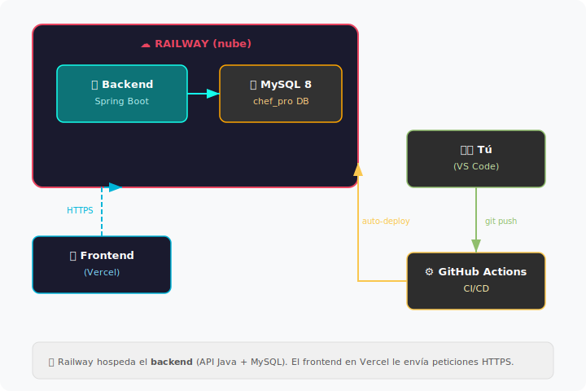
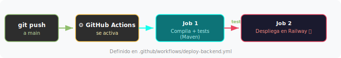

# Despliegue del Backend en Railway

Railway es la plataforma donde vive el backend (Spring Boot + MySQL) en producción. Básicamente, cada vez que haces push a `main`, GitHub Actions compila el proyecto, pasa los tests y lo despliega en Railway automáticamente.



## Resumen rápido

Si ya sabes lo que haces y solo quieres los pasos:

1. Crear cuenta en [railway.com](https://railway.com) con GitHub
2. Proyecto vacío → añadir MySQL → importar los SQL
3. Añadir servicio desde GitHub → meter las variables de entorno
4. Crear token en Railway → guardarlo como secreto en GitHub
5. Push a `main` y que se despliegue solo

Para el paso a paso completo, sigue leyendo.

---

## Índice

| # | Sección | Descripción |
|:-:|---------|-------------|
| 1 | [Requisitos previos](#1-requisitos-previos) | Lo que necesitas tener listo |
| 2 | [Crear cuenta](#2-crear-cuenta-en-railway) | Registro en Railway |
| 3 | [Proyecto + MySQL](#3-crear-proyecto-y-base-de-datos) | Montar la infraestructura |
| 4 | [Desplegar el backend](#4-desplegar-el-backend) | Primer deploy |
| 5 | [Variables de entorno](#5-configurar-variables-de-entorno) | Conectar backend con la BD |
| 6 | [CI/CD](#6-configurar-despliegue-automático-cicd) | Automatizar el deploy |
| 7 | [Verificar](#7-verificar-que-funciona) | Comprobar que va todo bien |
| — | [Problemas frecuentes](#problemas-frecuentes) | Cuando algo falla |
| — | [Glosario](#glosario) | Términos técnicos |
| — | [Archivos relevantes](#archivos-de-esta-rama) | Referencia |

---

## 1. Requisitos previos

Antes de tocar Railway, asegúrate de que tienes:

- [ ] Cuenta de GitHub con acceso al repo ChefPro
- [ ] El backend compilando bien (prueba con `./mvnw clean verify`)
- [ ] Estos archivos ya en la rama:
  - `src/backend/Dockerfile`
  - `railway.toml`
  - `.github/workflows/deploy-backend.yml`

---

## 2. Crear cuenta en Railway

1. Entra en [railway.com](https://railway.com)
2. **Login** → **Login with GitHub**
3. Autoriza Railway en tu cuenta
4. Puede que te pida verificar con tarjeta — tranquila, **no cobran** en el plan Trial

---

## 3. Crear proyecto y base de datos

### Crear el proyecto

1. En Railway → **New Project** → **Empty Project**
2. Ponle de nombre `chefpro-production`

Un "Proyecto" en Railway agrupa tus servicios (API, base de datos, etc.) en un mismo entorno.

### Añadir MySQL

1. Dentro del proyecto → **+ New** → **Database** → **MySQL**
2. Railway la crea automáticamente
3. Haz clic en el servicio MySQL → pestaña **Variables**
4. Ahí verás las credenciales generadas (`MYSQL_HOST`, `MYSQL_PORT`, etc.)

### Importar los datos iniciales

Esto solo se hace una vez. Después los datos persisten.

1. En el servicio MySQL → pestaña **Data** → **Query**
2. Pega el contenido de `src/backend/src/main/resources/database/01-create-schema.sql` → Ejecutar
3. Pega el contenido de `src/backend/src/main/resources/database/02-seeds.sql` → Ejecutar

<details>
<summary>Alternativa por terminal</summary>

```bash
# Usa los valores que aparecen en la pestaña Variables del servicio MySQL
mysql -h <MYSQL_HOST> -P <MYSQL_PORT> -u <MYSQL_USER> -p<MYSQL_PASSWORD> \
  < src/backend/src/main/resources/database/01-create-schema.sql

mysql -h <MYSQL_HOST> -P <MYSQL_PORT> -u <MYSQL_USER> -p<MYSQL_PASSWORD> chef_pro \
  < src/backend/src/main/resources/database/02-seeds.sql
```
</details>

---

## 4. Desplegar el backend

1. En el proyecto → **+ New** → **GitHub Repo**
2. Selecciona `varelaiglesiascarmen/ChefPro`
3. Railway detecta el `railway.toml` y el `Dockerfile` sin que tengas que hacer nada
4. El primer deploy arranca solo — espera a que termine

<details>
<summary>Alternativa: deploy manual con Railway CLI</summary>

```bash
npm install -g @railway/cli
railway login
railway link        # desde la raíz del repo
railway up
```
</details>

---

## 5. Configurar variables de entorno

**Este paso es crítico.** Sin las variables, el backend no sabe cómo conectarse a la base de datos.

1. En Railway → clic en el servicio del **backend** (no el de MySQL)
2. Pestaña **Variables** → **+ New Variable**
3. Railway inyecta automaticamente las variables `MYSQLHOST`, `MYSQLPORT`, `MYSQLDATABASE`, `MYSQLUSER` y `MYSQLPASSWORD` desde el servicio MySQL. `application.yml` las lee directamente, asi que **no necesitas anadir variables de conexion manualmente**. Solo anade estas opcionales:

| Variable | Valor | Para qué sirve |
|----------|-------|-----------------|
| `SPRING_JPA_SHOW_SQL` | `false` | No imprimir SQL en los logs |
| `LOG_LEVEL_SQL` | `WARN` | Reducir verbosidad |
| `LOG_LEVEL_BIND` | `WARN` | Reducir verbosidad |

<details>
<summary>Alternativa: usar SPRING_DATASOURCE_* para sobreescribir</summary>

Si necesitas sobreescribir la URL JDBC (por ejemplo, para anadir parametros de conexion):

| Variable | Valor |
|----------|-------|
| `SPRING_DATASOURCE_URL` | `jdbc:mysql://${{MySQL.MYSQLHOST}}:${{MySQL.MYSQLPORT}}/chef_pro` |
| `SPRING_DATASOURCE_USERNAME` | `${{MySQL.MYSQLUSER}}` |
| `SPRING_DATASOURCE_PASSWORD` | `${{MySQL.MYSQLPASSWORD}}` |

</details>

En local no afecta: `application.yml` tiene valores por defecto (localhost:3306/chef_pro), asi que sin las variables de entorno usa la configuracion local.

---

## 6. Configurar despliegue automático (CI/CD)

Para que cada push a `main` despliegue automáticamente, hay que darle a GitHub Actions acceso a Railway.

### Obtener el token

1. Ve a [railway.com/account/tokens](https://railway.com/account/tokens)
2. **Create Token** → ponle `github-actions-deploy`
3. Copia el token (solo se muestra una vez, así que no lo pierdas)

### Guardarlo en GitHub

1. En GitHub → tu repo → **Settings** → **Secrets and variables** → **Actions**
2. **New repository secret**
3. Nombre: `RAILWAY_TOKEN` / Valor: el token que acabas de copiar
4. **Add secret**

### El flujo

Cada vez que haces push a `main` con cambios en `src/backend/`:



Todo esto lo define `.github/workflows/deploy-backend.yml`.

---

## 7. Verificar que funciona

### Generar dominio público

1. En Railway → servicio backend → **Settings**
2. Sección **Networking** → **Generate Domain**
3. Te dará algo tipo `chefpro-production.up.railway.app`

### Probar la API

```bash
curl https://TU-DOMINIO.up.railway.app/api/auth/health
```

Si responde, la API está viva.

### Probar con Swagger

Abre en el navegador:
```
https://TU-DOMINIO.up.railway.app/swagger-ui/index.html
```

---

## Problemas frecuentes

### La app no arranca en Railway

Ve al servicio → **Deployments** → clic en el deploy fallido → **Logs**. Errores típicos:

| Error en los logs | Qué pasa | Solución |
|-------------------|----------|----------|
| `Communications link failure` | Las variables de MySQL están mal | Revisa las 3 `SPRING_DATASOURCE_*` |
| `Access denied` | Usuario o contraseña incorrectos | Compara con las Variables del servicio MySQL |
| `Port already in use` | Hay un puerto fijo en el código | Usa `${PORT:8080}`, nunca un puerto hardcodeado |

### Los tests fallan en GitHub Actions

Ve a **Actions** en GitHub → clic en el workflow fallido. Si el test necesita base de datos y falla, puede ser normal — los tests de integración requieren MySQL local.

### No puedo conectarme a la BD desde mi ordenador

1. En Railway → servicio MySQL → **Variables**
2. Copia la `MYSQL_URL` pública
3. Úsala en DBeaver, DataGrip, MySQL Workbench o lo que prefieras

---

## Glosario

| Término | Qué es |
|---------|--------|
| **PaaS** | Platform as a Service — Railway gestiona los servidores, tú subes código |
| **Docker** | Empaqueta tu app + dependencias en un contenedor reproducible |
| **Multi-stage build** | Dockerfile con 2 fases: compilar (pesado) y ejecutar (ligero). La imagen final pesa menos |
| **Variables de entorno** | Configuración que cambia entre entornos (local vs producción) sin tocar código |
| **CI/CD** | Integración y Despliegue Continuos — automatiza build, tests y deploy |
| **GitHub Actions** | Sistema de CI/CD integrado en GitHub |
| **Health Check** | Endpoint que Railway consulta para saber si la app sigue viva |
| **Secretos (GitHub)** | Variables cifradas que solo se descifran durante la ejecución de un workflow |

---

## Archivos de esta rama

| Archivo | Qué hace |
|---------|----------|
| `src/backend/Dockerfile` | Imagen Docker del backend (multi-stage build) |
| `src/backend/.dockerignore` | Excluye archivos del build Docker |
| `railway.toml` | Configuración de Railway |
| `.github/workflows/deploy-backend.yml` | Workflow CI/CD: compilar, testear y desplegar |
| `src/backend/src/main/resources/application.yml` | Variables dinámicas (funciona en Railway y en local) |
| `docs/RAILWAY-DEPLOY.md` | Este documento |
