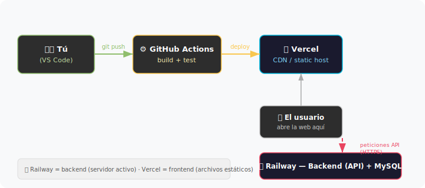
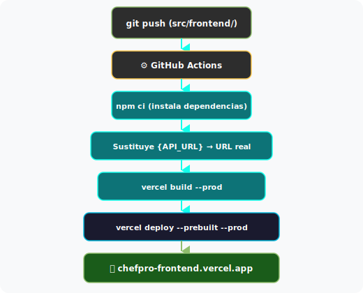
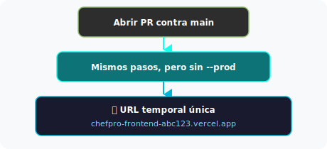
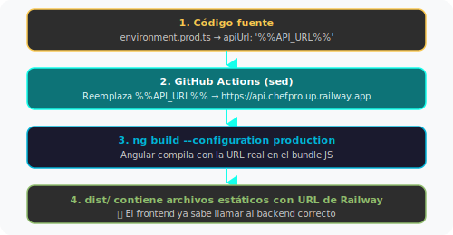

# Despliegue del Frontend en Vercel

Vercel es donde se aloja el frontend en producción. Se encarga de servir los archivos estáticos de Angular (HTML, CSS, JS) a través de una CDN global, así que la web carga rápido desde cualquier sitio.

Usamos dos plataformas distintas porque hacen cosas diferentes: Railway ejecuta el backend (Java + MySQL, que necesita un servidor corriendo), y Vercel sirve los archivos estáticos del frontend. Cada una en lo suyo.



## Resumen rápido

Si ya controlas el proceso:

1. Cuenta en [vercel.com](https://vercel.com) con GitHub
2. Instalar CLI → `vercel login` → `vercel link`
3. Guardar 3 secretos en GitHub (`VERCEL_TOKEN`, `VERCEL_ORG_ID`, `VERCEL_PROJECT_ID`)
4. Crear la variable `API_URL` con la URL de Railway
5. Push a `main` y listo

---

## Índice

| # | Sección | Descripción |
|:-:|---------|-------------|
| 1 | [Requisitos previos](#1-requisitos-previos) | Lo que necesitas |
| 2 | [Crear cuenta](#2-crear-cuenta-en-vercel) | Registro en Vercel |
| 3 | [Vincular el proyecto](#3-vincular-el-proyecto-con-vercel-cli) | Conectar repo con Vercel |
| 4 | [Secretos en GitHub](#4-configurar-secretos-en-github) | Guardar credenciales |
| 5 | [Variable de API](#5-configurar-la-url-de-la-api) | Apuntar al backend |
| 6 | [Verificar](#6-verificar-que-funciona) | Comprobar que va bien |
| — | [Cómo funciona por dentro](#cómo-funciona-el-despliegue-por-dentro) | Detalle técnico |
| — | [Problemas frecuentes](#problemas-frecuentes) | Cuando algo falla |
| — | [Glosario](#glosario) | Términos técnicos |
| — | [Archivos relevantes](#archivos-de-esta-rama) | Referencia |

---

## 1. Requisitos previos

- [ ] Cuenta de GitHub con acceso al repo ChefPro
- [ ] Node.js instalado (v20 o superior)
- [ ] Estos archivos ya en la rama:
  - `src/frontend/vercel.json`
  - `src/frontend/src/environments/environment.prod.ts`
  - `.github/workflows/deploy-frontend.yml`

---

## 2. Crear cuenta en Vercel

1. Entra en [vercel.com](https://vercel.com)
2. **Sign Up** → **Continue with GitHub**
3. Autoriza Vercel en tu cuenta
4. Selecciona el plan **Hobby** (gratuito)

---

## 3. Vincular el proyecto con Vercel CLI

Esto genera las credenciales que GitHub Actions necesita para hacer el deploy.

### Instalar e iniciar sesión

```bash
npm install -g vercel
vercel login            # se abre el navegador para autenticarte
```

### Vincular el repositorio

```bash
cd /ruta/a/ChefPro      # la raíz del repo
vercel link
```

Te hará unas preguntas:

| Pregunta | Respuesta |
|----------|-----------|
| Set up project? | **Yes** |
| Which scope? | Tu usuario de Vercel |
| Link to existing project? | **No** (crear uno nuevo) |
| Project name? | `chefpro-frontend` |
| Directory with source code? | `src/frontend` |

Esto crea `.vercel/project.json` con dos valores que vas a necesitar:

```json
{
  "orgId": "team_xxxxxxxxxxxx",
  "projectId": "prj_xxxxxxxxxxxx"
}
```

No subas `.vercel/` a Git — ya está en `.gitignore`.

### Obtener el token de API

1. Ve a [vercel.com/account/tokens](https://vercel.com/account/tokens)
2. **Create** → ponle `github-actions-deploy`
3. Scope: **Full Account**
4. Copia el token — solo se muestra una vez

---

## 4. Configurar secretos en GitHub

Los secretos permiten que GitHub Actions se autentique con Vercel sin exponer credenciales en el código.

1. En GitHub → tu repo → **Settings** → **Secrets and variables** → **Actions**
2. Pestaña **Secrets** → **New repository secret**
3. Crea estos 3:

| Nombre del secreto | Valor | De dónde sale |
|---------------------|-------|---------------|
| `VERCEL_TOKEN` | El token de API | Paso 3c |
| `VERCEL_ORG_ID` | `team_xxxxxxxxxxxx` | `.vercel/project.json` → `orgId` |
| `VERCEL_PROJECT_ID` | `prj_xxxxxxxxxxxx` | `.vercel/project.json` → `projectId` |

Los secretos de GitHub van cifrados. Una vez guardados, ni los admins del repo pueden ver su valor.

---

## 5. Configurar la URL de la API

El frontend necesita saber dónde está el backend para hacer las peticiones HTTP (login, buscar platos, etc.).

1. En GitHub → **Settings** → **Secrets and variables** → **Actions**
2. Pestaña **Variables** (ojo, no Secrets) → **New repository variable**
3. Nombre: `API_URL`
4. Valor: `https://chefpro-production.up.railway.app`

Sobre esto hay que tener en cuenta una cosa: Angular es una app estática, así que una vez compilada, la URL de la API queda incrustada en el JavaScript. Para cambiarla hay que recompilar (o sea, hacer otro push).

Si no defines `API_URL`, el workflow usa `/api` como fallback, y eso **no funciona en producción** porque Vercel no tiene proxy al backend.

---

## 6. Verificar que funciona

### Desde GitHub

1. Ve a **Actions** en tu repo
2. Busca el workflow **Deploy Frontend to Vercel**
3. Si aparece en verde, el deploy fue bien
4. En los logs del paso "Deploy to production" verás la URL

### Desde Vercel

1. Ve a [vercel.com/dashboard](https://vercel.com/dashboard)
2. Entra en tu proyecto `chefpro-frontend`
3. Ahí tienes el historial de deploys con su estado y URL

### Pruebas manuales

- [ ] Abre la URL de producción en el navegador
- [ ] Comprueba que la página principal se carga
- [ ] Navega a varias rutas (`/login`, `/about`, `/contact`)
- [ ] **Recarga la página** en una ruta que no sea `/` — debería seguir funcionando (si no, revisa los rewrites)
- [ ] DevTools → Network → las peticiones tienen que apuntar a la URL correcta de la API

---

## Cómo funciona el despliegue por dentro

### Deploy de producción (push a `main`)



### Deploy de preview (Pull Request)



El workflow solo se activa cuando hay cambios en `src/frontend/**`. Si un commit solo toca el backend, no gasta ejecución.

### Cómo se inyecta la URL de la API



---

## Problemas frecuentes

### El workflow falla en "Install frontend dependencies"

- Comprueba que `package-lock.json` existe en `src/frontend/` y está commiteado
- `npm ci` es estricto: necesita que `package-lock.json` coincida con `package.json`

### El workflow falla en "Pull Vercel configuration"

Comprueba que los 3 secretos están bien en GitHub:

| Secreto | Configurado? |
|---------|:------------:|
| `VERCEL_TOKEN` | |
| `VERCEL_ORG_ID` | |
| `VERCEL_PROJECT_ID` | |

Si el token ha caducado, crea uno nuevo en [vercel.com/account/tokens](https://vercel.com/account/tokens).

### Las rutas dan 404 al recargar

Asegúrate de que `vercel.json` tiene la regla de rewrites:
```json
"rewrites": [{ "source": "/(.*)", "destination": "/index.html" }]
```
Y que el archivo está en `src/frontend/` (junto a `angular.json`).

### Las peticiones a la API fallan

| Síntoma | Causa | Solución |
|---------|-------|----------|
| Las peticiones van a `/api` | Falta `API_URL` | Configúrala en GitHub (paso 5) y haz un nuevo push |
| Las peticiones van bien pero da error CORS | El backend no permite el dominio de Vercel | Configurar CORS en Spring Boot |

### El build local funciona pero el de Vercel falla

Vercel usa Node.js 20 — comprueba que tu proyecto es compatible. Revisa los logs en Vercel Dashboard → Deployments → clic en el fallido.

<details>
<summary>Probar el build de producción en local</summary>

```bash
cd src/frontend
npx ng build --configuration production
# Los archivos se generan en dist/frontend/browser/
npx serve dist/frontend/browser
```

Ten en cuenta que en local `environment.prod.ts` tiene `{API_URL}` como placeholder. Para probarlo bien, sustituye ese valor a mano o usa `ng serve` (que tira de `environment.ts` con `/api` + proxy).
</details>

---

## Glosario

| Término | Qué es |
|---------|--------|
| **SPA** | Single Page Application — Angular genera una sola página HTML y la navegación ocurre en el navegador |
| **Static Hosting** | Vercel sirve archivos estáticos (HTML/CSS/JS), no ejecuta código de servidor |
| **CDN** | Content Delivery Network — los archivos se replican en servidores por todo el mundo |
| **Preview Deployments** | Cada PR genera una URL temporal para probar los cambios antes de mergear |
| **Environment Files** | Angular usa `environment.ts` (local) y `environment.prod.ts` (producción) |
| **File Replacements** | Mecanismo de Angular para intercambiar archivos según el modo de build |
| **SPA Rewrites** | Regla del servidor que redirige todas las rutas a `index.html` para que Angular Router funcione |
| **Build-time injection** | Inyectar valores de configuración durante la compilación, no en runtime |
| **CI/CD** | Integración y Despliegue Continuos |
| **GitHub Secrets** | Variables cifradas accesibles solo durante la ejecución de workflows |

---

## Archivos de esta rama

| Archivo | Qué hace |
|---------|----------|
| `src/frontend/vercel.json` | Configura Vercel: build, directorio de salida y rewrites para SPA |
| `src/frontend/src/environments/environment.prod.ts` | Entorno de producción con placeholder `{API_URL}` |
| `src/frontend/angular.json` | Configuración de `fileReplacements` para producción |
| `src/frontend/src/app/services/search-results.service.ts` | Sustituye URL hardcodeada por `environment.apiUrl` |
| `.github/workflows/deploy-frontend.yml` | Workflow CI/CD para compilar y desplegar en Vercel |
| `docs/VERCEL-DEPLOY.md` | Este documento |

<details>
<summary>Detalle de los archivos de configuración</summary>

**`vercel.json`** — Le dice a Vercel cómo tratar el proyecto:
```json
{
  "buildCommand": "npm run build",
  "outputDirectory": "dist/frontend/browser",
  "framework": "angular",
  "rewrites": [{ "source": "/(.*)", "destination": "/index.html" }]
}
```
Sin los `rewrites`, acceder directamente a `/login` da 404 porque Vercel no sabe que es una SPA.

**`environment.prod.ts`** — Configuración de producción:
```typescript
export const environment = {
  production: true,
  apiUrl: '{API_URL}'  // Se reemplaza durante el build
};
```

**`fileReplacements` en `angular.json`** — Al compilar con `--configuration production`, Angular usa `environment.prod.ts` en vez de `environment.ts`.
</details>
